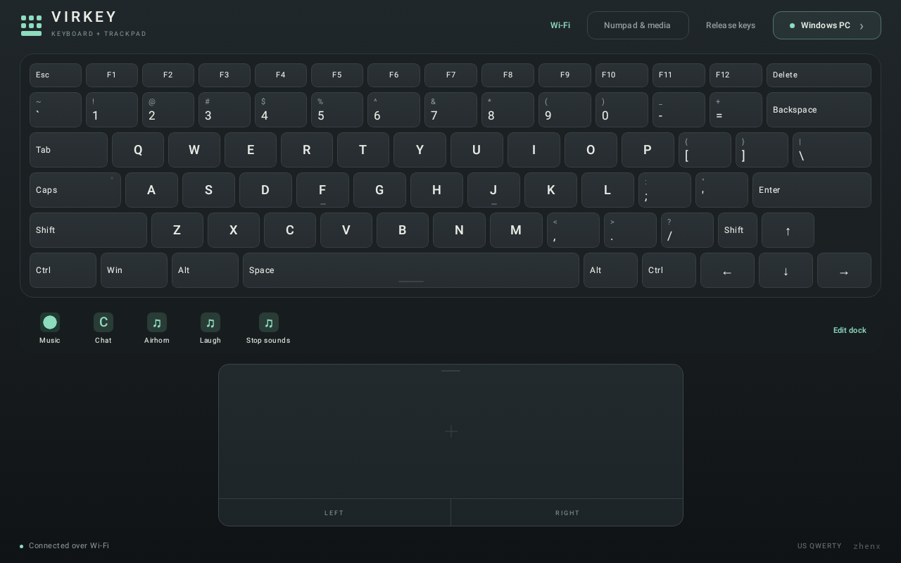
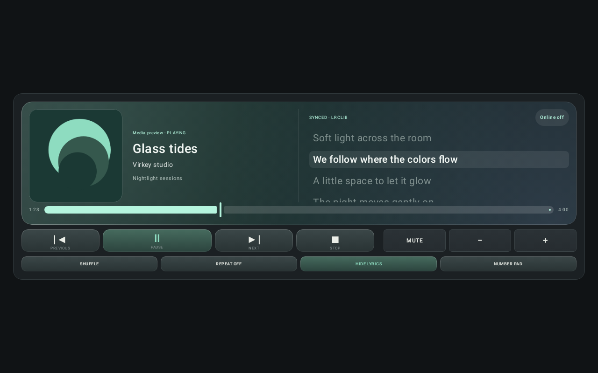
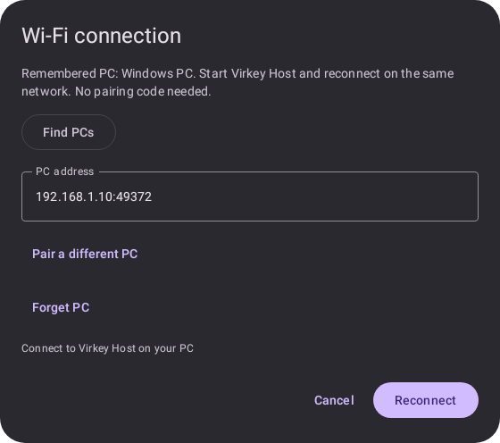

# Virkey


An Android tablet keyboard and trackpad for a Windows PC. Bluetooth is the first-run default and presents a standard HID keyboard and mouse without a PC receiver. Optional Wi-Fi mode uses the portable Virkey Host for Windows, adding live media details and playback controls. Virkey remembers your last transport and trusted Wi-Fi PC.

This test build targets landscape Android tablets and Windows 11. Compiling and automated tests do not establish compatibility with a particular tablet's Bluetooth firmware: the real tablet-to-PC checks below are required.

## Download 0.6.0

- [Android APK](https://github.com/zhenxxx7/virkey/releases/download/v0.6.0/virkey-0.6.0.apk)
- [Windows host EXE](https://github.com/zhenxxx7/virkey/releases/download/v0.6.0/virkey-host-0.6.0.exe) — needed only for Wi-Fi
- [Checksums and release notes](https://github.com/zhenxxx7/virkey/releases/tag/v0.6.0)

This release adds a customizable app/soundboard dock, larger glass-style media
artwork, optional online lyrics, PIN-free Wi-Fi reconnect after the first pairing,
and the Virkey logo on the Windows EXE, window and tray.

**Upgrading:** install the APK over the previous build, exit the old Windows host
from its tray menu, then run the new EXE. Pair once with the new host; later use
**Reconnect** without a PIN. The APK remains development-signed and the EXE is
unsigned. See [release notes](docs/releases/0.6.0.md),
[installation and device checks](docs/testing-0.6.0.md), and
[automated validation](docs/validation-0.6.0.md).

## Previews

### Custom app and soundboard dock



### Keyboard and trackpad


### Number pad and Bluetooth media controls


### Wi-Fi media session


### Live media panel


### Glass player and lyrics



Preview artwork, track names, and lyric lines are synthetic fixtures, not a live service capture.

### Windows host


### Remembered Wi-Fi connection



## First connection

1. Install the APK on the tablet and open **Virkey**.
2. Tap **Connect to PC**, allow **Nearby devices**, and enable Bluetooth if prompted. Allow notifications to make the session's Disconnect action accessible outside the app.
3. On Windows, open **Settings → Bluetooth & devices → Add device → Bluetooth**.
4. In Virkey, tap **Pair new Windows PC** and approve Android's discoverability prompt. Select the tablet's existing Bluetooth name in Windows; it may appear as the device's system Bluetooth name rather than Virkey.
5. Confirm the matching pairing codes on the tablet and PC. Return to Virkey, tap **Refresh**, and select your PC if it has not connected automatically.
6. Close the connection dialog with **Start typing**. Open Notepad on the PC and try the keyboard and trackpad.

Use **English (United States) / US** as the Windows keyboard layout for matching key legends. The tablet sends physical keyboard usages; Windows determines the resulting characters.

If the PC was paired with the tablet before Virkey was installed and only sees phone/file-transfer services, remove the tablet in Windows Bluetooth settings and pair again while Virkey's keyboard session is running. Virkey does not silently remove existing pairings.

**Upgrading from 0.1.0:** version 0.2.0 adds a Bluetooth media-control report. If media buttons do nothing, remove the tablet from Windows Bluetooth settings and pair again with Virkey open so Windows can refresh the device capabilities.

## Controls

| Control | Behavior |
| --- | --- |
| Keyboard key | Press while touching; release when lifted or cancelled |
| Shift, Ctrl, Alt, Win | Hold with another finger while pressing another key |
| Caps | Toggle Windows Caps Lock; indicator follows Windows LED feedback |
| Numpad & media / Keyboard | Switch the upper deck; the trackpad stays available below |
| Number pad | Physical keypad keys; Num Lock indicator follows Windows feedback |
| Media controls | Mute, volume down/up, previous, play/pause, next, and stop |
| Bluetooth / Wi-Fi | Switch input transport; release and disconnect the previous session |
| Wi-Fi Reconnect | Reuse the saved PC identity and reconnect token; no PIN on ordinary subsequent connections |
| Wi-Fi now playing | Artwork, title, artist, album, playback timing, and supported player controls |
| Wi-Fi seek bar | Seek within the current track when the player supports it |
| Lyrics | Expand the player; optionally enable online lyrics, with timed highlighting when available |
| Timed lyric line | Tap to seek when the current player supports seeking |
| Expand / Number pad | Give the media player the full upper deck, or restore the number pad |
| One finger on trackpad | Move the mouse pointer |
| One-finger tap | Left-click |
| Two-finger tap | Right-click |
| Two-finger vertical movement | Scroll |
| Hold one finger still, then move | Select text or drag without pressing LEFT; lift to release |
| LEFT button held + another finger on trackpad | Drag |
| RIGHT button | Right mouse button, including press-and-hold |
| Release keys / switching decks | Release every keyboard, media, and mouse input |
| Connection dialog / notification → Disconnect | End the Bluetooth keyboard session |

The keyboard includes Esc, F1–F12, Delete, a US QWERTY section, modifiers, and an inverted-T arrow cluster. It deliberately has no fake hardware Fn key. Mouse gestures are relative mouse input, not Windows Precision Touchpad gestures; three/four-finger Windows gestures are not implemented.

To select text, first position the PC pointer at the selection start. Hold one finger still on the trackpad until its border turns green (about half a second, following Android's long-press setting), then move that same finger. Lift to release the selection. Adding a second finger ends the held drag and allows scrolling. The separate LEFT button remains available for manual dragging. Media actions depend on the PC's active media player and are unavailable in Bluetooth boot protocol mode.

## Session behavior

- Keep Virkey visible while using the keyboard. The screen stays awake while the app is visible.
- A connected-device foreground service and notification maintain registration through pairing dialogs. Switching away releases all locally held inputs. Removing Virkey from Recents stops the session.
- Disconnects clear local key state. A fresh connection sends empty input reports before accepting new input. A failed send ends the connection rather than replaying input later.
- Only one PC is active at a time. Reconnecting is explicit; Virkey remembers the last selected transport and PC but does not connect or type automatically after launch. The first launch still defaults to Bluetooth.
- Wi-Fi requires Android's Internet permission for local network sockets. Keyboard/mouse input and artwork stay on the local network. First pairing uses a manually verified certificate fingerprint and host PIN over TLS; subsequent connections use the saved certificate and a protected reconnect token, never a stored PIN. There are no accounts, analytics, or keystroke logs.
- Online lyrics are optional and off until enabled in the Lyrics pane. While that pane is visible and enabled, track title, artist, album and duration are sent over HTTPS to LRCLIB; the provider also sees the device's public IP. No keys, pairing PINs, PC identifiers or artwork are sent. **Online off** disables lookup; hiding the pane or leaving the media deck stops requests. Results are cached only in memory.
- Wi-Fi disconnects when the app leaves the foreground. The host releases held input on disconnect, shutdown, suspend, or a four-second heartbeat timeout. Reconnect explicitly when returning to the app.

Android 9 / API 28 is the minimum. Bluetooth mode requires the OS to expose the Bluetooth HID Device profile. The Wi-Fi host targets Windows 11 x64. Other desktop operating systems, pre-login screens, BIOS, and behavior under device battery management have not been certified. USB transport, remote screen viewing, clipboard sync, and macros are not implemented.

## Wi-Fi and live media

Run the portable Windows host, start hosting, and switch Virkey's header from
**Bluetooth** to **Wi-Fi**. Open **Connect to PC**, find your PC or enter its
address, then enter its PIN. Compare the fingerprint shown on both devices
before confirming **Trust & pair**. Both devices must be on the same reachable
local network. Windows Firewall may need to allow the host on a private network.

With app and host **0.6.0 or newer**, pair once; later, open **Connect to PC →
Reconnect** with no PIN or repeated fingerprint prompt. The host keeps its
identity across restarts. If the saved address stops working, Virkey makes one
LAN discovery attempt to find the same pinned PC; manual address editing also
works. A different certificate is never silently accepted. **Forget PC** removes
the tablet's saved pairing. **Reset pairing** on the host revokes all remembered
tablets and generates a new PIN. See [reconnect setup and recovery](docs/reconnect-0.6.0.md).

The media deck displays the current Windows media session with larger artwork,
artwork-colored glass layers and soft highlights. Artwork and timing come from
the player; seek, shuffle, repeat, and transport controls enable only when
supported. **Expand** gives the player more room without hiding the trackpad.
Bluetooth continues to offer media buttons without track data.

For lyrics, tap **Lyrics → Enable online lyrics**. Timed lyrics highlight and
scroll with the PC timeline; tap a line to seek. Plain lyrics are shown when
timing is unavailable. Tracks must match LRCLIB's catalog; not every song,
recording, podcast or video has lyrics. Internet is needed only for lookup,
not keyboard input or local playback controls. This is not a Spotify login or
access to Spotify's private lyrics service. See [the media testing guide](docs/media-0.5.0.md).

See [the testing guide](docs/testing-0.6.0.md) for device checks. Download
the current APK and Windows host from [GitHub Releases](https://github.com/zhenxxx7/virkey/releases/latest).

## App dock and soundboard

The customizable dock supports app and soundboard buttons. Use **Edit dock** to add,
rename, reorder or remove up to 24 buttons. PC apps get their Windows icon
automatically; **Choose image** sets your own, and **Auto icon** restores it.
App launch requires Wi-Fi with Virkey Host 0.4.0 or newer; Start-menu shortcuts appear
automatically, and **Extra apps** in the host adds portable apps or shortcuts.

**Sound / hotkey** buttons work over Bluetooth or Wi-Fi. Assign the same shortcut
to a sound or voice inside Voicemod (or another soundboard), then create its dock
button. This controls the existing PC soundboard through keybinds; sounds and
voice processing stay in that application. See the [dock setup guide](docs/dock-0.4.0.md).

## Build

Use JDK 17, Android SDK platform 36 / build tools 35.0.0, and the included Gradle wrapper. Android Studio can open this directory directly; select JDK 17 for Gradle. The included Windows scripts can keep downloaded tools and caches in `.tools/` without changing machine-wide settings.

```powershell
# Download pinned official tool archives and complete Google's SDK license prompt.
.\scripts\setup-toolchain.ps1

# Build APK, run JVM tests, and run Android lint.
.\scripts\build.ps1

# Only after changing the Android vector logo: regenerate the Windows icon.
powershell.exe -NoProfile -STA -File .\scripts\render-host-icon.ps1

# Build the optional portable Windows Wi-Fi host and run its self-tests.
.\scripts\build-host.ps1
```

The Android build is signed with a development key for testing. GitHub releases
use a clean versioned APK filename. A production release requires a separate
private signing key and release process. Never commit signing keys.

For build dependencies, checksums, and SDK setup details, see [docs/toolchain.md](docs/toolchain.md).
Release packaging is documented in [docs/publishing.md](docs/publishing.md).
Binaries are release assets, not tracked source. The separate local `website/`
directory is ignored and is not part of this repository's source or release.

## Device acceptance checklist

Run these on your Android tablet and Windows 11 before treating the build as reliable:

1. Pair from a clean pairing and from an existing tablet pairing; verify keyboard and mouse both appear and work.
2. Type letters, numbers, punctuation, Enter, Tab, Backspace, and arrows in Notepad. Hold a key to test Windows key repeat.
3. Hold Shift while typing; test Ctrl+A, Ctrl+C, Ctrl+V, Alt+Tab, and Win. Check that releasing either finger releases that key and no modifier stays held.
4. Test pointer motion, one-finger tap, double-click, two-finger right-click, scrolling, hold-to-select, and LEFT-button dragging. Lifting one finger after a scroll must not cause a click or cursor jump. A stationary long press should turn the trackpad border green; moving selects text and lifting ends the drag.
5. While holding a key or dragging, switch apps, lock the tablet, turn Bluetooth off, and disconnect. Confirm no stuck input remains; reconnect and repeat.
6. Sleep and wake Windows, reconnect manually, and verify Caps Lock feedback and input. Record any repair/re-pair requirement.
7. Try tablet multi-window and both landscape directions. Android 16 may ignore orientation requests on large displays; use landscape full-screen for the laptop arrangement.
8. Open **Numpad & media**, turn Num Lock on, and test every keypad key in Notepad. Verify the Num Lock indicator, volume/mute, and media transport in a compatible player. Switch decks while holding a key and verify it releases.
9. Pair over Wi-Fi once; restart the app and host, then reconnect without a PIN. Check **Forget PC** and Windows **Reset pairing**. Repeat after rebooting both devices.
10. Add an app and soundboard hotkey to the dock; verify automatic/custom icons and saved order. Expand the media player and test opt-in lyrics, seeking, disabling lyrics and offline behavior.

## Code map

- `input/`: pure Kotlin HID reports, physical key mapping, rollover handling.
- `bluetooth/`: Android HID profile, pairing/connection state, foreground session.
- `network/`: pinned TLS Wi-Fi session, discovery, input serialization, media state.
- `dock/`: persistent custom buttons, images and ordered soundboard hotkeys.
- `media/`: opt-in HTTPS lyric lookup, bounded in-memory cache and LRC parsing.
- `windows/Virkey.Host/`: portable Windows input receiver, pairing, and media bridge.
- `ui/`: Compose laptop surface, connection dialog, pointer gestures.
- `MainActivity`: Android permission and system pairing flows, lifecycle release handling.
- `app/src/test/`: HID, layout, gesture, and UI checks.

## Platform references

- [Android Bluetooth HID Device](https://developer.android.com/reference/android/bluetooth/BluetoothHidDevice)
- [Android Bluetooth permissions](https://developer.android.com/develop/connectivity/bluetooth/bt-permissions)
- [Android connected-device foreground service](https://developer.android.com/develop/background-work/services/fgs/service-types#connected-device)
- [Windows built-in HID transports](https://learn.microsoft.com/en-us/windows-hardware/drivers/hid/hid-transports)
- [Bluetooth HID profile and boot protocol](https://www.bluetooth.com/wp-content/uploads/2023/08/HID-Lite-WP-V10.pdf)
- [LRCLIB API](https://lrclib.net/docs)
- [Android Keystore](https://developer.android.com/privacy-and-security/keystore)
- [Windows data protection](https://learn.microsoft.com/en-us/dotnet/api/system.security.cryptography.protecteddata)
