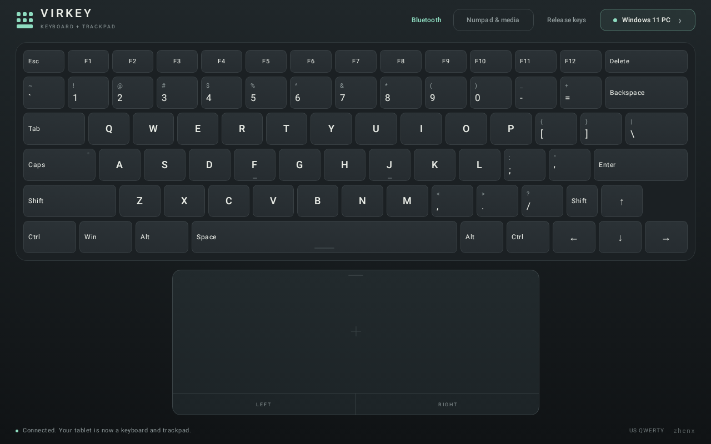
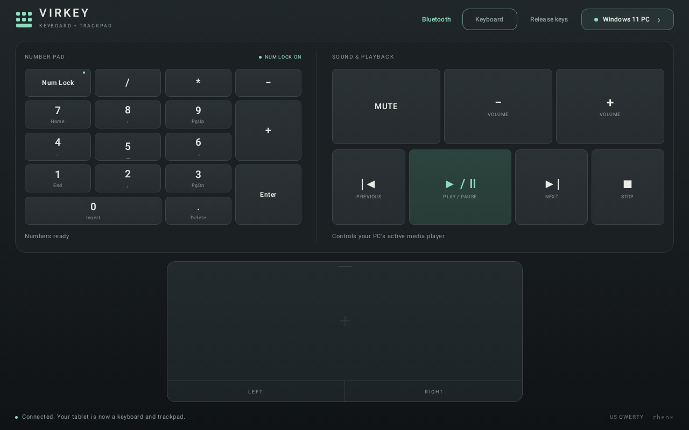
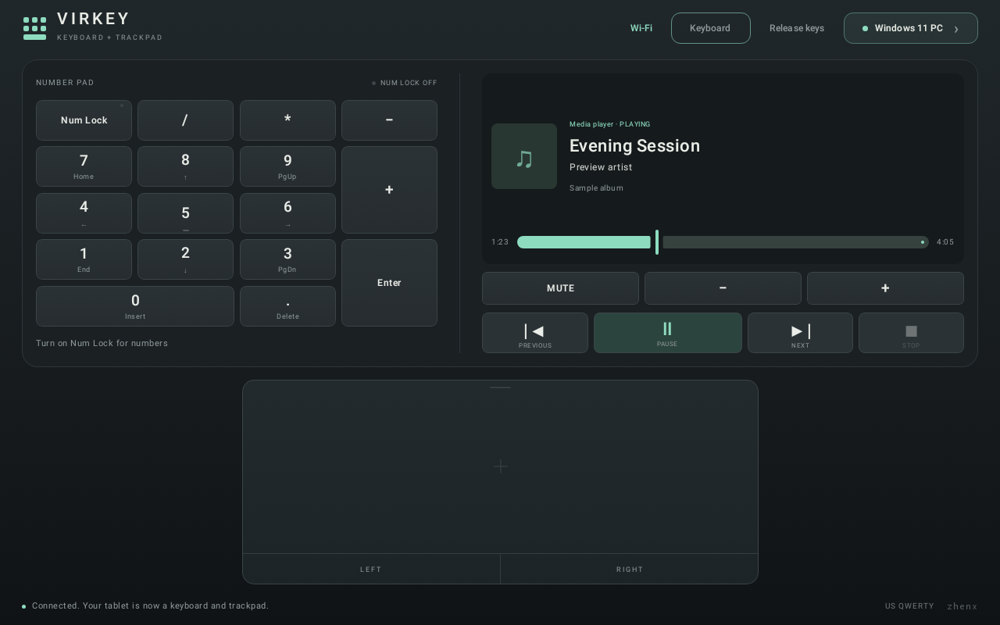
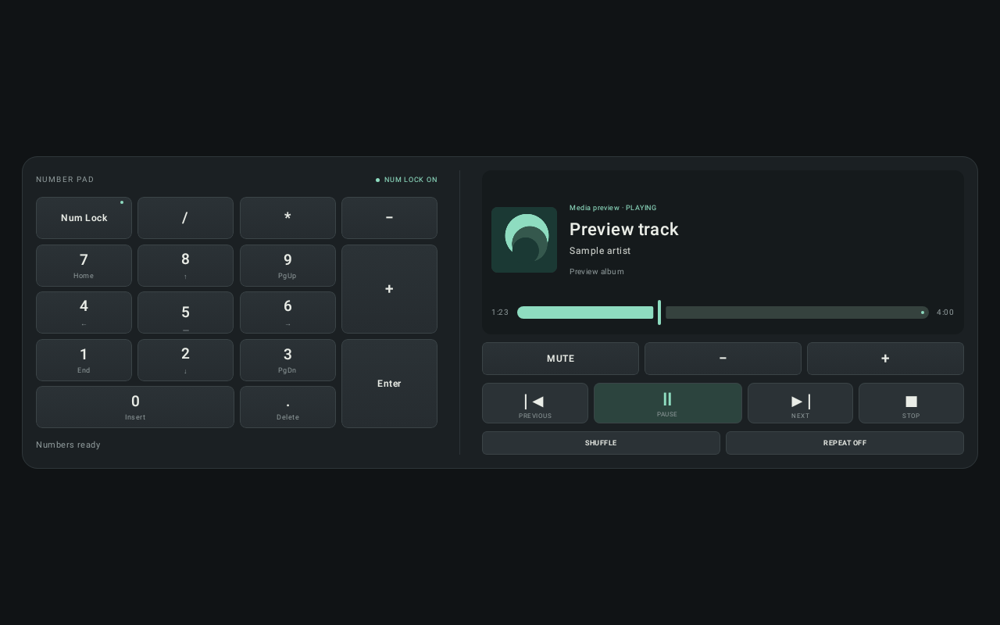
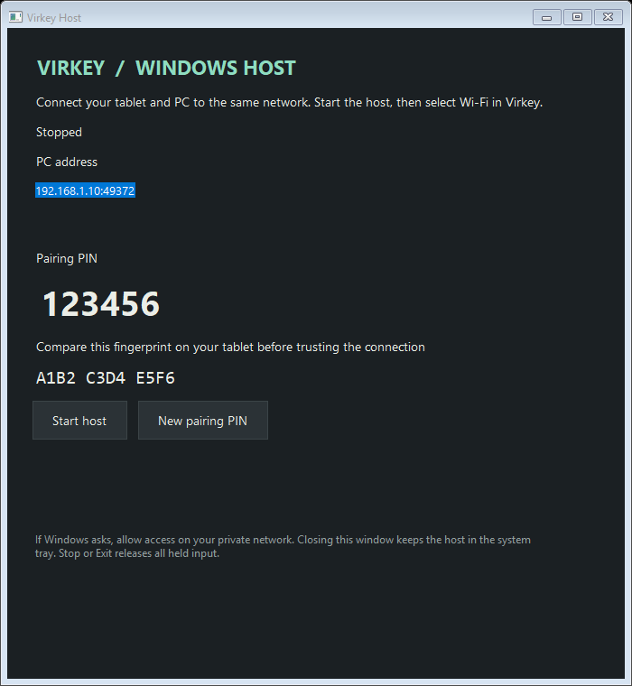

# Virkey

An Android tablet keyboard and trackpad for a Windows PC. Bluetooth is the default and presents a standard HID keyboard and mouse without a PC receiver. Optional Wi-Fi mode uses the portable Virkey Host for Windows, adding live media details and playback controls.

This test build targets landscape Android tablets and Windows 11. Compiling and automated tests do not establish compatibility with a particular tablet's Bluetooth firmware: the real tablet-to-PC checks below are required.

## Previews

### Keyboard and trackpad



### Number pad and Bluetooth media controls



### Wi-Fi media session



### Live media panel



### Windows host



## First connection

1. Install the APK on the tablet and open **Virkey**.
2. Tap **Connect to PC**, allow **Nearby devices**, and enable Bluetooth if prompted. Allow notifications to make the session's Disconnect action accessible outside the app.
3. On Windows, open **Settings → Bluetooth & devices → Add device → Bluetooth**.
4. In Virkey, tap **Pair new Windows PC** and approve Android's discoverability prompt. Select the tablet's existing Bluetooth name in Windows; it may appear as the device's system Bluetooth name rather than Virkey.
5. Confirm the matching pairing codes on the tablet and PC. Return to Virkey, tap **Refresh**, and select your PC if it has not connected automatically.
6. Close the connection dialog with **Start typing**. Open Notepad on the PC and try the keyboard and trackpad.

Use **English (United States) / US** as the Windows keyboard layout for matching key legends. The tablet sends physical keyboard usages; Windows determines the resulting characters.

If the PC was paired with the tablet before Virkey was installed and only sees phone/file-transfer services, remove the tablet in Windows Bluetooth settings and pair again while Virkey's keyboard session is running. Virkey does not silently remove existing pairings.

**Upgrading from 0.1.0:** version 0.2.0 adds a Bluetooth media-control report. If media buttons do nothing, remove the tablet from Windows Bluetooth settings and pair again with Virkey open so Windows can refresh the device capabilities.

## Controls

| Control | Behavior |
| --- | --- |
| Keyboard key | Press while touching; release when lifted or cancelled |
| Shift, Ctrl, Alt, Win | Hold with another finger while pressing another key |
| Caps | Toggle Windows Caps Lock; indicator follows Windows LED feedback |
| Numpad & media / Keyboard | Switch the upper deck; the trackpad stays available below |
| Number pad | Physical keypad keys; Num Lock indicator follows Windows feedback |
| Media controls | Mute, volume down/up, previous, play/pause, next, and stop |
| Bluetooth / Wi-Fi | Switch input transport; release and disconnect the previous session |
| Wi-Fi now playing | Artwork, title, artist, album, playback timing, and supported player controls |
| Wi-Fi seek bar | Seek within the current track when the player supports it |
| One finger on trackpad | Move the mouse pointer |
| One-finger tap | Left-click |
| Two-finger tap | Right-click |
| Two-finger vertical movement | Scroll |
| Hold one finger still, then move | Select text or drag without pressing LEFT; lift to release |
| LEFT button held + another finger on trackpad | Drag |
| RIGHT button | Right mouse button, including press-and-hold |
| Release keys / switching decks | Release every keyboard, media, and mouse input |
| Connection dialog / notification → Disconnect | End the Bluetooth keyboard session |

The keyboard includes Esc, F1–F12, Delete, a US QWERTY section, modifiers, and an inverted-T arrow cluster. It deliberately has no fake hardware Fn key. Mouse gestures are relative mouse input, not Windows Precision Touchpad gestures; three/four-finger Windows gestures are not implemented.

To select text, first position the PC pointer at the selection start. Hold one finger still on the trackpad until its border turns green (about half a second, following Android's long-press setting), then move that same finger. Lift to release the selection. Adding a second finger ends the held drag and allows scrolling. The separate LEFT button remains available for manual dragging. Media actions depend on the PC's active media player and are unavailable in Bluetooth boot protocol mode.

## Session behavior

- Keep Virkey visible while using the keyboard. The screen stays awake while the app is visible.
- A connected-device foreground service and notification maintain registration through pairing dialogs. Switching away releases all locally held inputs. Removing Virkey from Recents stops the session.
- Disconnects clear local key state. A fresh connection sends empty input reports before accepting new input. A failed send ends the connection rather than replaying input later.
- Only one PC is active at a time. Reconnecting is explicit; Virkey remembers the last selected PC but does not connect or type automatically after launch.
- Wi-Fi requires Android's Internet permission for local network sockets. There are no cloud services, accounts, analytics, or keystroke logs. Pairing uses a manually verified certificate fingerprint and a host PIN over TLS.
- Wi-Fi disconnects when the app leaves the foreground. The host releases held input on disconnect, shutdown, suspend, or a four-second heartbeat timeout. Reconnect explicitly when returning to the app.

Android 9 / API 28 is the minimum. Bluetooth mode requires the OS to expose the Bluetooth HID Device profile. The Wi-Fi host targets Windows 11 x64. Other desktop operating systems, pre-login screens, BIOS, and behavior under device battery management have not been certified. USB transport, remote screen viewing, clipboard sync, and macros are not implemented.

## Wi-Fi and live media

Run the portable Windows host, start hosting, and switch Virkey's header from
**Bluetooth** to **Wi-Fi**. Open **Connect to PC**, find your PC or enter its
address, then enter its PIN. Compare the fingerprint shown on both devices
before confirming **Trust & pair**. Both devices must be on the same reachable
local network. Windows Firewall may need to allow the host on a private network.

The media deck displays the current Windows media session. Artwork and timing
come from the player; seek, shuffle, repeat, and transport controls enable only
when supported. Bluetooth continues to offer media buttons without track data.

See [the local testing guide](docs/testing-0.3.0.md) for device checks. Download
the current APK and Windows host from [GitHub Releases](https://github.com/zhenxxx7/virkey/releases/latest).

## Build

Use JDK 17, Android SDK platform 36 / build tools 35.0.0, and the included Gradle wrapper. Android Studio can open this directory directly; select JDK 17 for Gradle. The included Windows scripts can keep downloaded tools and caches in `.tools/` without changing machine-wide settings.

```powershell
# Download pinned official tool archives and complete Google's SDK license prompt.
.\scripts\setup-toolchain.ps1

# Build APK, run JVM tests, and run Android lint.
.\scripts\build.ps1

# Build the optional portable Windows Wi-Fi host and run its self-tests.
.\scripts\build-host.ps1
```

The Android build is signed with a development key for testing. GitHub releases
use a clean versioned APK filename. A production release requires a separate
private signing key and release process. Never commit signing keys.

For build dependencies, checksums, and SDK setup details, see [docs/toolchain.md](docs/toolchain.md).

## Device acceptance checklist

Run these on your Android tablet and Windows 11 before treating the build as reliable:

1. Pair from a clean pairing and from an existing tablet pairing; verify keyboard and mouse both appear and work.
2. Type letters, numbers, punctuation, Enter, Tab, Backspace, and arrows in Notepad. Hold a key to test Windows key repeat.
3. Hold Shift while typing; test Ctrl+A, Ctrl+C, Ctrl+V, Alt+Tab, and Win. Check that releasing either finger releases that key and no modifier stays held.
4. Test pointer motion, one-finger tap, double-click, two-finger right-click, scrolling, hold-to-select, and LEFT-button dragging. Lifting one finger after a scroll must not cause a click or cursor jump. A stationary long press should turn the trackpad border green; moving selects text and lifting ends the drag.
5. While holding a key or dragging, switch apps, lock the tablet, turn Bluetooth off, and disconnect. Confirm no stuck input remains; reconnect and repeat.
6. Sleep and wake Windows, reconnect manually, and verify Caps Lock feedback and input. Record any repair/re-pair requirement.
7. Try tablet multi-window and both landscape directions. Android 16 may ignore orientation requests on large displays; use landscape full-screen for the laptop arrangement.
8. Open **Numpad & media**, turn Num Lock on, and test every keypad key in Notepad. Verify the Num Lock indicator, volume/mute, and media transport in a compatible player. Switch decks while holding a key and verify it releases.

## Code map

- `input/`: pure Kotlin HID reports, physical key mapping, rollover handling.
- `bluetooth/`: Android HID profile, pairing/connection state, foreground session.
- `network/`: pinned TLS Wi-Fi session, discovery, input serialization, media state.
- `windows/Virkey.Host/`: portable Windows input receiver, pairing, and media bridge.
- `ui/`: Compose laptop surface, connection dialog, pointer gestures.
- `MainActivity`: Android permission and system pairing flows, lifecycle release handling.
- `app/src/test/`: HID, layout, gesture, and UI checks.

## Platform references

- [Android Bluetooth HID Device](https://developer.android.com/reference/android/bluetooth/BluetoothHidDevice)
- [Android Bluetooth permissions](https://developer.android.com/develop/connectivity/bluetooth/bt-permissions)
- [Android connected-device foreground service](https://developer.android.com/develop/background-work/services/fgs/service-types#connected-device)
- [Windows built-in HID transports](https://learn.microsoft.com/en-us/windows-hardware/drivers/hid/hid-transports)
- [Bluetooth HID profile and boot protocol](https://www.bluetooth.com/wp-content/uploads/2023/08/HID-Lite-WP-V10.pdf)
